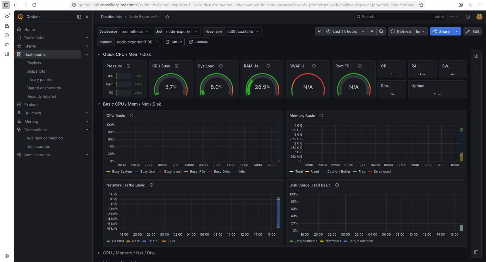
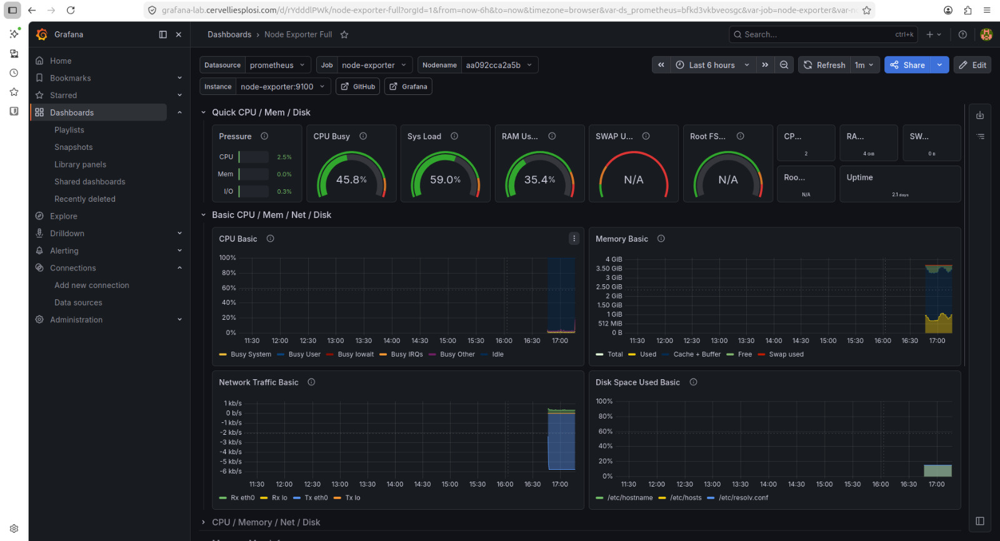

# Prometheus + Grafana Monitoring Lab

Hands-on observability project deployed on Ubuntu VPS using Docker, Prometheus and Grafana.

---

## Public HTTPS Endpoint

Grafana deployed behind Nginx reverse proxy (authentication required).

🔗 https://grafana-lab.cervelliesplosi.com

## GitHub Repository

🔗 https://github.com/gabrieleventura/prometheus-grafana-monitoring-lab

## LinkedIn

🔗 https://www.linkedin.com/in/gabriele-ventura-6b549829b/

---

## Objective

Deploy a full monitoring stack using containers and expose dashboards securely over HTTPS.

---

## Stack

- Prometheus
- Grafana
- Node Exporter
- cAdvisor
- Docker Compose
- Nginx reverse proxy
- Let's Encrypt
- Ubuntu 24.04

---

## What I Implemented

- Real-time Linux server monitoring
- Docker container metrics collection
- Public HTTPS Grafana exposure
- Reverse proxy with Nginx
- Prometheus datasource integration
- Dashboard deployment and configuration
- External DNS + TLS setup

---

## Screenshots

### Grafana Dashboard

### Live Metrics Under Load

---

## Key Learning

Deploying services is one thing.

Understanding system behaviour in production is another.

Monitoring transforms infrastructure into something visible, measurable and improvable.

---

## Skills Demonstrated

- Linux Administration
- Docker Operations
- Monitoring & Observability
- Metrics Pipelines
- Reverse Proxying
- HTTPS / TLS
- Troubleshooting
- Production Thinking
